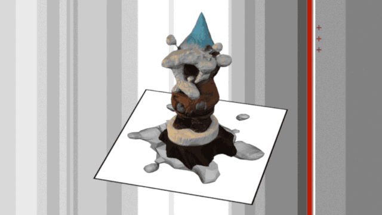

In Manifest Data, the S-1 Lab uses localized network analysis tools to capture the content and destination of user-scattered cookie crumbs dropped, most often unknowingly and unintentionally, during Internet browsing sessions. The code recipe for Manifest Data transforms the protocological underpinnings of networking technologies — specifically IP addresses and port numbers — into points defining a vector field that can be geographically mapped, fed into a 3D printer or dynamically sculpted by a professional artist. Manifest Data is our digital double.

We published this as a kit in [*hyperrhiz*](http://hyperrhiz.io/hyperrhiz13/sensors-data-bodies/manifest-data.html).